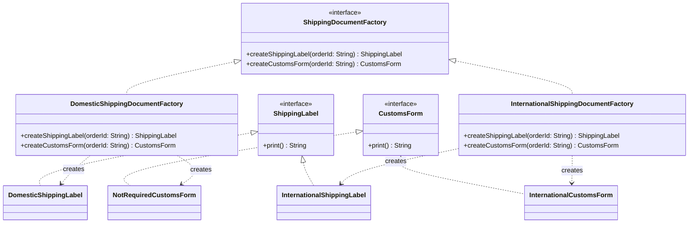

# Abstract Factory

**Category:** Creational · **Source:** [`src/main/java/com/javapatternslab/abstractfactory/`](../../src/main/java/com/javapatternslab/abstractfactory) · **Test:** [`AbstractFactoryTest`](../../src/test/java/com/javapatternslab/abstractfactory/AbstractFactoryTest.java)

## Problem

Shipping an order needs two related documents — a shipping label and a customs form — and the two documents' concrete implementations have to agree with each other on which shipping mode they belong to. Domestic orders need a domestic label and no customs form; international orders need an international label *and* a real customs declaration. Constructing each document independently makes it easy to accidentally pair a domestic label with an international customs form, or forget the customs form entirely.

## Solution

Where [Factory Method](factory.md) produces **one** product, Abstract Factory produces a **family** of related products that are guaranteed to match. `ShippingDocumentFactory` declares `createShippingLabel(orderId)` and `createCustomsForm(orderId)`; `DomesticShippingDocumentFactory` returns a `DomesticShippingLabel` paired with a `NotRequiredCustomsForm` (a no-op implementation of the same `CustomsForm` interface), while `InternationalShippingDocumentFactory` returns an `InternationalShippingLabel` paired with a real `InternationalCustomsForm`. Calling code picks one factory for the whole order and gets a matching pair back — it's structurally impossible to mix a domestic label with an international customs form.

## UML



## Try it

```bash
mvn -q compile exec:java -Dexec.mainClass="com.javapatternslab.abstractfactory.AbstractFactoryDemo"
```

`AbstractFactoryDemo` builds the same order's documents through both factories, printing each matched label/customs-form pair.
