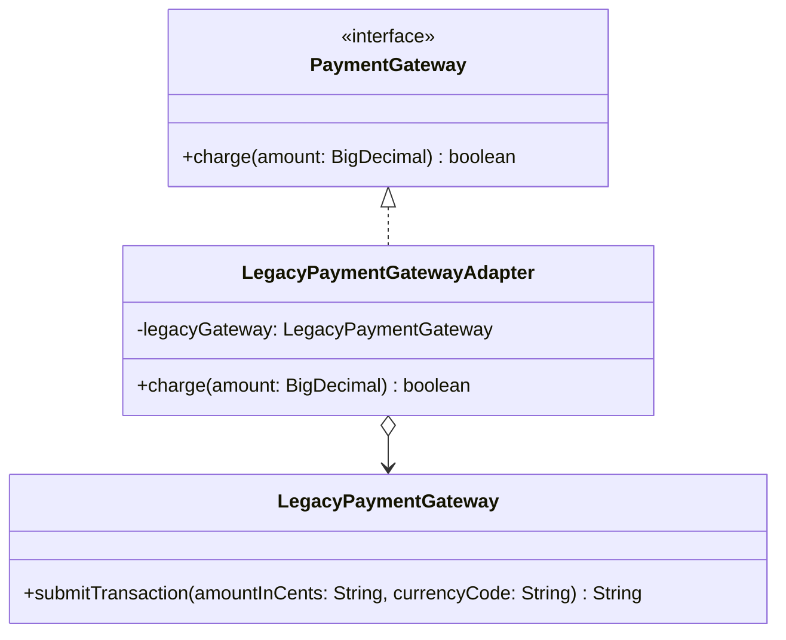

# Adapter

**Category:** Structural · **Source:** [`src/main/java/com/javapatternslab/adapter/`](../../src/main/java/com/javapatternslab/adapter) · **Test:** [`AdapterTest`](../../src/test/java/com/javapatternslab/adapter/AdapterTest.java)

## Problem

The app's checkout code is written against a clean `PaymentGateway` interface: `charge(BigDecimal amount)`. But the only available gateway for one payment provider is a legacy client, `LegacyPaymentGateway`, with an incompatible, string-based API from years ago: `submitTransaction(String amountInCents, String currencyCode)`, returning a raw status string. Rewriting the legacy client is out of scope (or impossible — it's a third-party jar); rewriting the checkout code to speak the legacy client's API everywhere would leak that awkward shape across the whole app.

## Solution

`LegacyPaymentGatewayAdapter` implements the modern `PaymentGateway` interface and wraps a `LegacyPaymentGateway` instance internally. Its `charge(BigDecimal amount)` method does the translation once — converting the amount to the legacy string-cents format, calling `submitTransaction`, and translating the legacy status string back into the modern return type — so every other class in the app only ever sees `PaymentGateway`. The legacy client's awkward shape is contained to one class.

## UML



## Try it

```bash
mvn -q compile exec:java -Dexec.mainClass="com.javapatternslab.adapter.AdapterDemo"
```

`AdapterDemo` calls `charge(...)` through the modern `PaymentGateway` interface while the legacy client underneath logs its own string-based call, showing the translation happening transparently.
