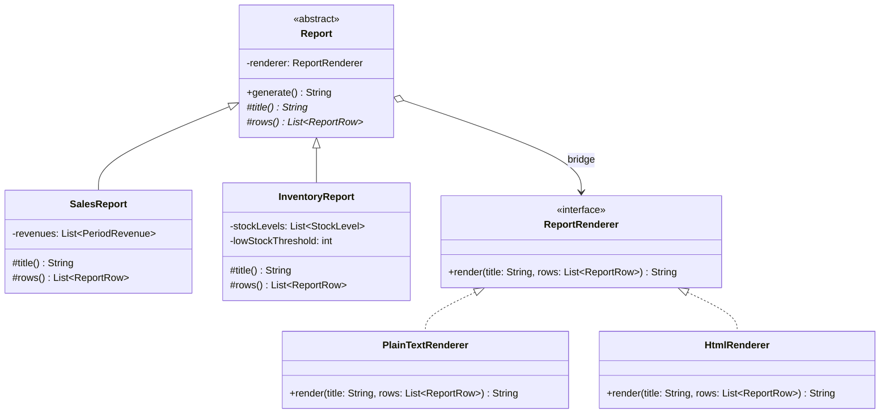

# Bridge

**Category:** Structural · **Source:** [`src/main/java/com/javapatternslab/bridge/`](../../src/main/java/com/javapatternslab/bridge) · **Test:** [`BridgeTest`](../../src/test/java/com/javapatternslab/bridge/BridgeTest.java)

## Problem

The back office needs several **kinds** of report (sales, inventory) in several **output formats** (plain text for the terminal, HTML for email). These are two independent axes of variation. Modelling both with inheritance gives one class per combination — `SalesTextReport`, `SalesHtmlReport`, `InventoryTextReport`, `InventoryHtmlReport` — and every new report kind or new format multiplies the class count instead of adding to it.

## Solution

The two axes become two separate hierarchies joined by composition. `Report` (the abstraction) knows *what* a report contains: a title and a list of `ReportRow`s, supplied by `SalesReport` and `InventoryReport`. `ReportRenderer` (the implementor) knows *how* to turn a title and rows into output, with `PlainTextRenderer` and `HtmlRenderer`. A `Report` holds a `ReportRenderer` and delegates to it in `generate()`. The class count now grows by addition instead of multiplication: a third format is one new renderer that works with every existing report, and a third report kind is one new `Report` subclass that works with every existing renderer.

This is the difference from [Template Method](template-method.md), which also has reports in this catalog: there the format is fixed by *which subclass you instantiate*, so only one axis can vary. Here the format is an object passed in, so both axes vary independently.

## UML



## Try it

```bash
mvn -q compile exec:java -Dexec.mainClass="com.javapatternslab.bridge.BridgeDemo"
```

`BridgeDemo` generates the sales report and the inventory report once per renderer, printing the same data as plain text and then as HTML.
