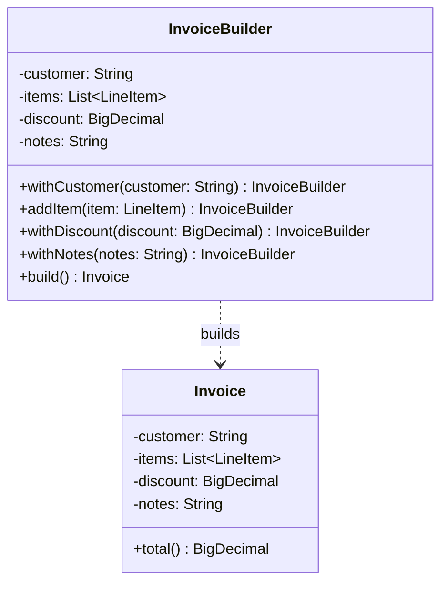

# Builder

**Category:** Creational · **Source:** [`src/main/java/com/javapatternslab/builder/`](../../src/main/java/com/javapatternslab/builder) · **Test:** [`BuilderTest`](../../src/test/java/com/javapatternslab/builder/BuilderTest.java)

## Problem

An `Invoice` has a few required fields (customer name, line items) and several optional ones (discount, notes, due date). A telescoping constructor (`Invoice(customer, items)`, `Invoice(customer, items, discount)`, `Invoice(customer, items, discount, notes)`, ...) grows unreadable fast, and a single giant constructor with every optional field defaulted to `null`/`0` makes call sites impossible to read at a glance ("what does the fourth `null` mean?").

## Solution

`Invoice` is immutable and has no public constructor — only a private one, called from `InvoiceBuilder`. The builder exposes fluent setters for every field (`withCustomer(...)`, `addItem(...)`, `withDiscount(...)`, `withNotes(...)`) and a terminal `build()` that validates required fields are present before constructing the `Invoice`. Call sites read like a sentence, optional fields are visibly named, and `Invoice` itself can never exist in a half-built state.

## UML



## Try it

```bash
mvn -q compile exec:java -Dexec.mainClass="com.javapatternslab.builder.BuilderDemo"
```

`BuilderDemo` builds one minimal invoice (required fields only) and one fully-loaded invoice (discount + notes), printing both totals.
