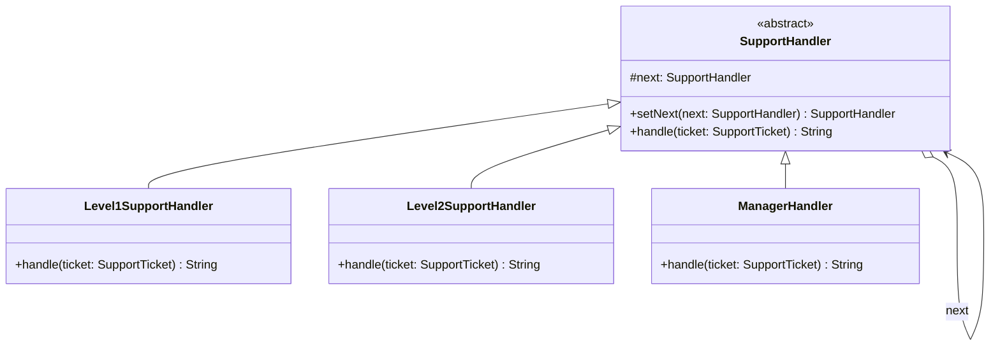

# Chain of Responsibility

**Category:** Behavioral · **Source:** [`src/main/java/com/javapatternslab/chainofresponsibility/`](../../src/main/java/com/javapatternslab/chainofresponsibility) · **Test:** [`ChainOfResponsibilityTest`](../../src/test/java/com/javapatternslab/chainofresponsibility/ChainOfResponsibilityTest.java)

## Problem

A support ticket needs to be handled by the right tier: low-severity tickets by Level 1, medium by Level 2, and only critical ones should ever reach a Manager. A single method with nested `if (severity == ...)` checks works at first, but it hard-codes the routing policy in one place, and testing "what does Level 2 do with a ticket" means dragging in the whole routing conditional.

## Solution

Each tier is a `SupportHandler` holding a reference to the next handler in the chain. `handle(ticket)` either resolves the ticket itself (if its severity is within that tier's capability) or forwards it to the next handler. `Level1SupportHandler → Level2SupportHandler → ManagerHandler` are wired into a chain once, and each handler only knows about "can I handle this, and who's next" — not the full routing policy. Reordering or inserting a new tier means relinking the chain, not rewriting a conditional.

## UML



## Try it

```bash
mvn -q compile exec:java -Dexec.mainClass="com.javapatternslab.chainofresponsibility.ChainOfResponsibilityDemo"
```

`ChainOfResponsibilityDemo` builds the L1 → L2 → Manager chain and sends three tickets of increasing severity through it, printing which tier resolves each one.
