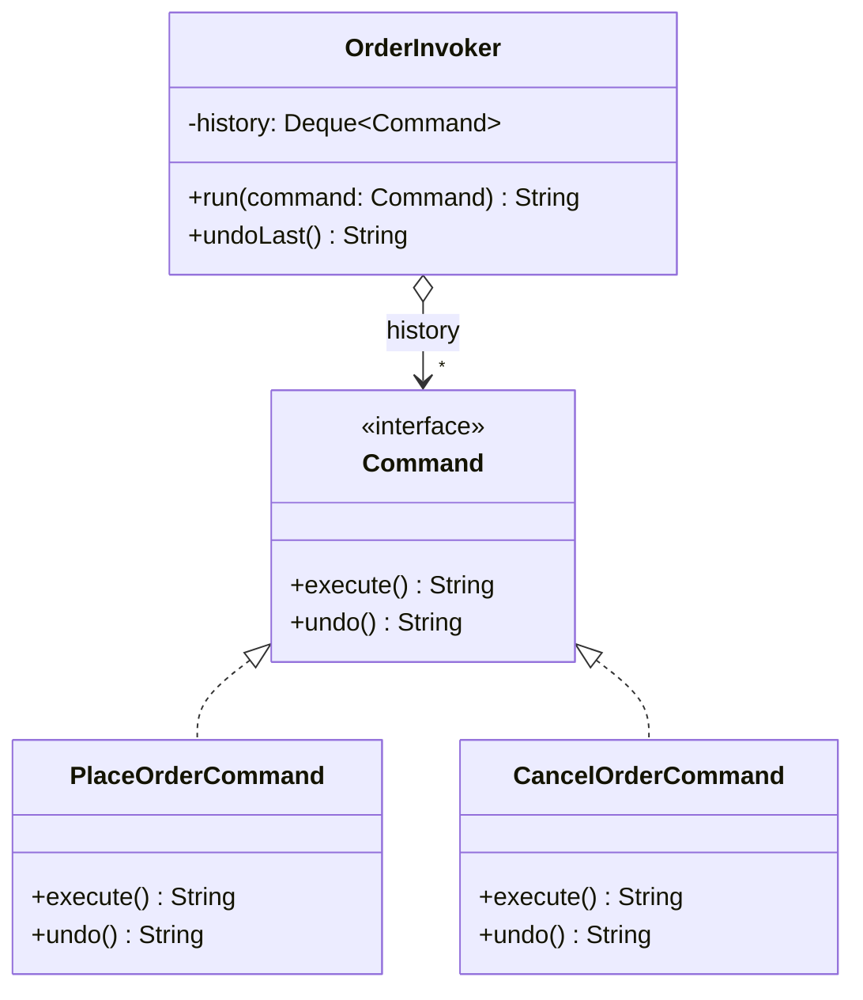

# Command

**Category:** Behavioral · **Source:** [`src/main/java/com/javapatternslab/command/`](../../src/main/java/com/javapatternslab/command) · **Test:** [`CommandTest`](../../src/test/java/com/javapatternslab/command/CommandTest.java)

## Problem

An order-management panel needs to place and cancel orders, keep a history of what was done, and support undoing the last action. If "place order" and "cancel order" are just method calls, there's nowhere to hang a history or an undo stack — the caller would need bespoke bookkeeping for every action type it wants to be undoable.

## Solution

`PlaceOrderCommand` and `CancelOrderCommand` both implement a `Command` interface with `execute()` and `undo()`. An `OrderInvoker` doesn't know what a command does — it just calls `execute()` and pushes the command onto a history stack, and `undo()` pops the stack and calls `undo()` on whatever's popped. Adding a new undoable action means writing one new `Command` implementation; the invoker's history/undo bookkeeping never changes.

## UML



## Try it

```bash
mvn -q compile exec:java -Dexec.mainClass="com.javapatternslab.command.CommandDemo"
```

`CommandDemo` runs a place-order command then a cancel-order command through one `OrderInvoker`, then calls `undoLast()` twice, printing the invoker's history at each step.
