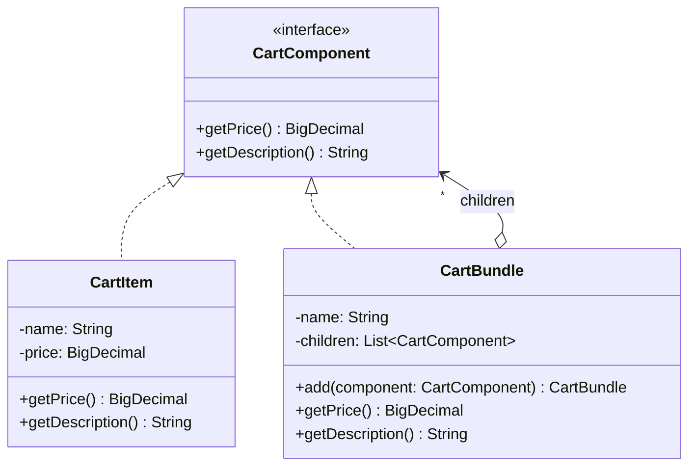

# Composite

**Category:** Structural · **Source:** [`src/main/java/com/javapatternslab/composite/`](../../src/main/java/com/javapatternslab/composite) · **Test:** [`CompositeTest`](../../src/test/java/com/javapatternslab/composite/CompositeTest.java)

## Problem

A shopping cart holds individual products, but also **bundles** — a "starter kit" sold as one line that's actually several products (and a bundle could itself contain another bundle, e.g. a "mega kit" made of two starter kits). Computing a cart's total needs to treat a single product and an arbitrarily nested bundle the same way: "what does this cost," recursively.

## Solution

`CartComponent` declares `getPrice()` and `getDescription()`. `CartItem` (a leaf) implements it directly for one product. `CartBundle` (a composite) also implements `CartComponent`, but holds a list of child `CartComponent`s — which can themselves be `CartItem`s or further `CartBundle`s — and computes `getPrice()` by summing its children's prices. Calling code never needs to check "is this a leaf or a bundle": it calls `getPrice()` on whatever `CartComponent` it has, and the recursion happens for free.

## UML



## Try it

```bash
mvn -q compile exec:java -Dexec.mainClass="com.javapatternslab.composite.CompositeDemo"
```

`CompositeDemo` builds a bundle containing two items and a nested sub-bundle, then prints the total price computed recursively across every level.
