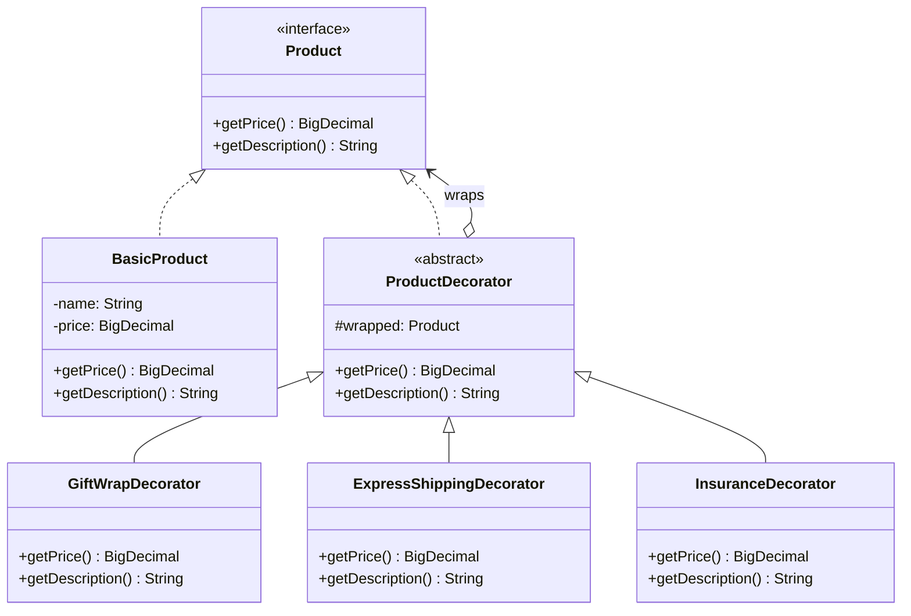

# Decorator

**Category:** Structural · **Source:** [`src/main/java/com/javapatternslab/decorator/`](../../src/main/java/com/javapatternslab/decorator) · **Test:** [`DecoratorTest`](../../src/test/java/com/javapatternslab/decorator/DecoratorTest.java)

## Problem

A `Product` has a base price. At checkout the customer can add gift wrap, express shipping and/or insurance, each adding its own cost and its own line in the description — in any combination. Modeling every combination as a subclass (`GiftWrappedExpressProduct`, `InsuredExpressProduct`, `GiftWrappedInsuredExpressProduct`, ...) is combinatorial and grows every time a new add-on is introduced.

## Solution

`GiftWrapDecorator`, `ExpressShippingDecorator` and `InsuranceDecorator` all implement the same `Product` interface (`getPrice()`, `getDescription()`) and wrap another `Product` instance, adding their own cost/description on top of whatever they wrap. Because a decorator *is* a `Product`, decorators can be stacked in any order and any combination — `new InsuranceDecorator(new GiftWrapDecorator(baseProduct))` — each layer only knowing about the one thing it adds, not the full combination.

## UML



## Try it

```bash
mvn -q compile exec:java -Dexec.mainClass="com.javapatternslab.decorator.DecoratorDemo"
```

`DecoratorDemo` wraps a base product in all three decorators, one layer at a time, printing the running price and description after each wrap.
