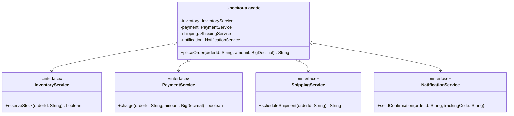

# Facade

**Category:** Structural · **Source:** [`src/main/java/com/javapatternslab/facade/`](../../src/main/java/com/javapatternslab/facade) · **Test:** [`FacadeTest`](../../src/test/java/com/javapatternslab/facade/FacadeTest.java)

## Problem

Placing an order actually means coordinating four subsystems in a specific order: reserve stock in inventory, charge the payment, schedule the shipment, then send a confirmation — and stop early if any step fails (no point scheduling a shipment for a payment that was declined). If every caller (a web controller, a CLI, a batch job) has to know this sequence and wire up all four subsystems itself, that orchestration logic gets duplicated and drifts.

## Solution

`CheckoutFacade` sits in front of `InventoryService`, `PaymentService`, `ShippingService` and `NotificationService` and exposes one method, `placeOrder(orderId, amount)`, that runs the four steps in the right order and short-circuits on the first failure. Callers depend on the facade alone — they never touch the four subsystems directly, and the orchestration logic (including "stop if payment is declined") lives in exactly one place.

## UML



## Try it

```bash
mvn -q compile exec:java -Dexec.mainClass="com.javapatternslab.facade.FacadeDemo"
```

`FacadeDemo` places one order through the default (all-succeed) subsystems, then places a second order against a payment service rigged to decline, showing the shipping/notification steps never run.
