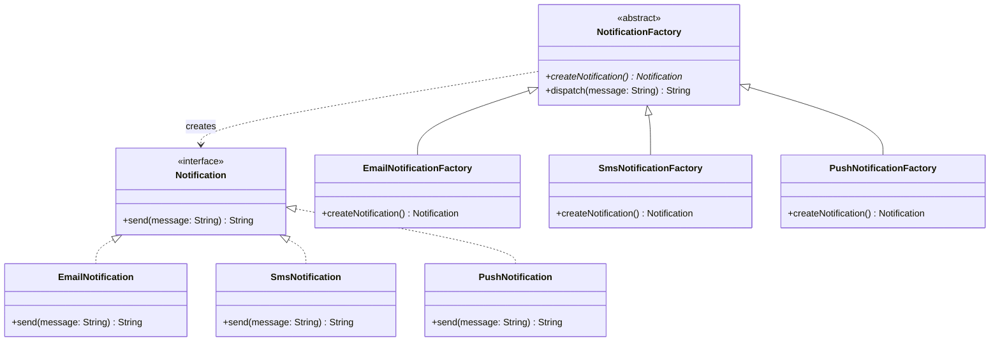

# Factory Method

**Category:** Creational · **Source:** [`src/main/java/com/javapatternslab/factory/`](../../src/main/java/com/javapatternslab/factory) · **Test:** [`FactoryMethodTest`](../../src/test/java/com/javapatternslab/factory/FactoryMethodTest.java)

## Problem

An order confirmation needs to notify the customer by email, SMS or push, depending on their preference. Calling code that just wants "a notification for this channel" shouldn't need to know about `EmailNotification`, `SmsNotification` and `PushNotification` constructors directly, or it ends up littered with `new` calls and channel-specific setup logic every place a notification is sent.

## Solution

Define a `Notification` interface (`send(String message)`) and an abstract `NotificationFactory` with one factory method, `createNotification()`. Each concrete factory (`EmailNotificationFactory`, `SmsNotificationFactory`, `PushNotificationFactory`) knows how to build its one kind of `Notification`, including any channel-specific setup. Calling code depends only on `NotificationFactory` and `Notification` — it asks a factory for a notification and sends it, never naming a concrete class. Adding a new channel means adding one new factory/product pair, with zero changes to existing call sites.

## UML



## Try it

```bash
mvn -q compile exec:java -Dexec.mainClass="com.javapatternslab.factory.FactoryMethodDemo"
```

`FactoryMethodDemo` iterates over all three factories through the single `NotificationFactory` abstraction and dispatches through each.
