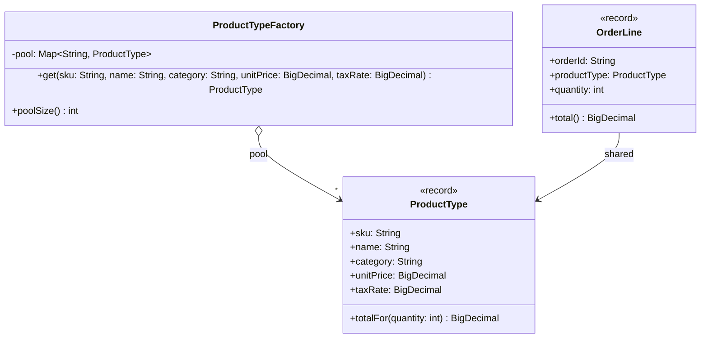

# Flyweight

**Category:** Structural · **Source:** [`src/main/java/com/javapatternslab/flyweight/`](../../src/main/java/com/javapatternslab/flyweight) · **Test:** [`FlyweightTest`](../../src/test/java/com/javapatternslab/flyweight/FlyweightTest.java)

## Problem

A sales report loads every order line of the month into memory — tens of thousands of them — but the store only sells a few hundred distinct products. If each line carries its own copy of the product's name, category, unit price and tax rate, the same handful of values is duplicated on every line, and memory grows with the number of lines instead of the number of products.

## Solution

Split each line's data in two. The **intrinsic** state — what is identical for every line of the same product (SKU, name, category, unit price, tax rate) — moves into an immutable `ProductType`, the flyweight. The **extrinsic** state — what is unique to one line (order id, quantity) — stays in `OrderLine`, which holds only a reference to its `ProductType`. `ProductTypeFactory` keeps a pool keyed by SKU and returns the existing instance when one is already there, so ten thousand lines point at the same few objects. Operations that need both halves take the extrinsic part as a parameter: `ProductType.totalFor(quantity)`.

Sharing is only safe because `ProductType` is immutable (a record). A flyweight that could be changed through one line would change for every line that shares it.

This looks like the caching [Proxy](proxy.md) but the goal differs: the proxy avoids repeating an expensive *lookup*; the flyweight avoids holding duplicate *objects*.

## UML



## Try it

```bash
mvn -q compile exec:java -Dexec.mainClass="com.javapatternslab.flyweight.FlyweightDemo"
```

`FlyweightDemo` creates 9,000 order lines across 3,000 orders and prints how many `ProductType` objects actually exist (3), along with the grand total computed through the shared instances.
