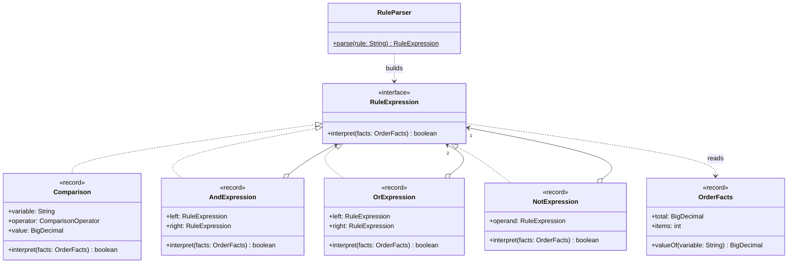

# Interpreter

**Category:** Behavioral · **Source:** [`src/main/java/com/javapatternslab/interpreter/`](../../src/main/java/com/javapatternslab/interpreter) · **Test:** [`InterpreterTest`](../../src/test/java/com/javapatternslab/interpreter/InterpreterTest.java)

## Problem

Marketing changes promotion eligibility every week: "orders of R$300 or more with at least 2 items", then "R$1,000 or more, or 5+ items above R$200". If each rule is an `if` in the checkout code, every change is a code change, a review and a deploy. The rules need to live as **data** — a line of text in a config file or a database row — that the application can read and evaluate against any order.

## Solution

Define a small language for the rules and give each rule of its grammar a class:

```
rule       := and ( "OR" and )*
and        := unary ( "AND" unary )*
unary      := "NOT" unary | "(" rule ")" | comparison
comparison := variable operator number        e.g.  total >= 300
```

`RuleExpression` declares `interpret(facts)`. `Comparison` is the **terminal** expression: it looks its variable up in `OrderFacts` (the context) and compares it with a number. `AndExpression`, `OrExpression` and `NotExpression` are the **nonterminal** expressions: each holds other `RuleExpression`s and combines their results. A rule is therefore a tree of these objects, and evaluating it is a recursive `interpret` call from the root — the same shape as [Composite](composite.md), applied to a sentence in a language.

The pattern itself is only that tree. Getting from text to the tree is the job of `RuleParser`, a recursive-descent parser with one method per grammar line; parsing lowest precedence first is what makes `AND` bind tighter than `OR`. A rule is parsed once and can then be interpreted against any number of orders, and a malformed rule fails at parse time rather than during a customer's checkout.

Interpreter suits grammars this small. Each new construct is one more class, which stops scaling quickly; a language with many constructs is better served by a parser generator or an existing expression engine.

## UML



## Try it

```bash
mvn -q compile exec:java -Dexec.mainClass="com.javapatternslab.interpreter.InterpreterDemo"
```

`InterpreterDemo` parses three rules from text, prints the tree each one became (with the precedence made explicit by parentheses), and evaluates every rule against three different orders.
