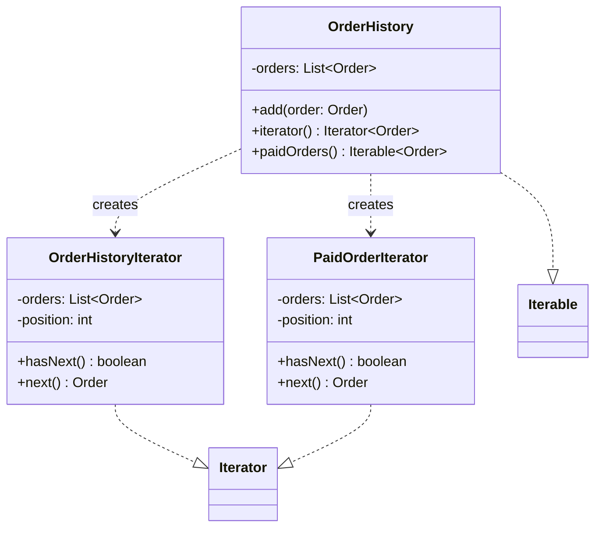

# Iterator

**Category:** Behavioral · **Source:** [`src/main/java/com/javapatternslab/iterator/`](../../src/main/java/com/javapatternslab/iterator) · **Test:** [`IteratorTest`](../../src/test/java/com/javapatternslab/iterator/IteratorTest.java)

## Problem

`OrderHistory` needs to be walked two different ways: "every order, in the order it was added" and "just the paid ones." Exposing the underlying list directly (`getOrders()`) lets every caller reinvent both traversals themselves, and couples them to `OrderHistory` storing its orders in a `List` at all — a later switch to a different internal structure would break every caller.

## Solution

`OrderHistory` implements `Iterable<Order>`, so a plain `for (Order order : history)` walks every order via a custom `OrderHistoryIterator` (implementing `Iterator<Order>` by hand — tracking its own position and throwing `NoSuchElementException` past the end — rather than just handing out the internal list's own iterator). A second method, `paidOrders()`, returns a separate `Iterable<Order>` backed by `PaidOrderIterator`, which skips non-paid orders inside its own `hasNext()`. Both traversals hide `OrderHistory`'s internal storage completely; callers just iterate.

## UML



## Try it

```bash
mvn -q compile exec:java -Dexec.mainClass="com.javapatternslab.iterator.IteratorDemo"
```

`IteratorDemo` adds orders with mixed statuses to one `OrderHistory`, then iterates it twice: once with a plain for-each over every order, once over `paidOrders()` only.
