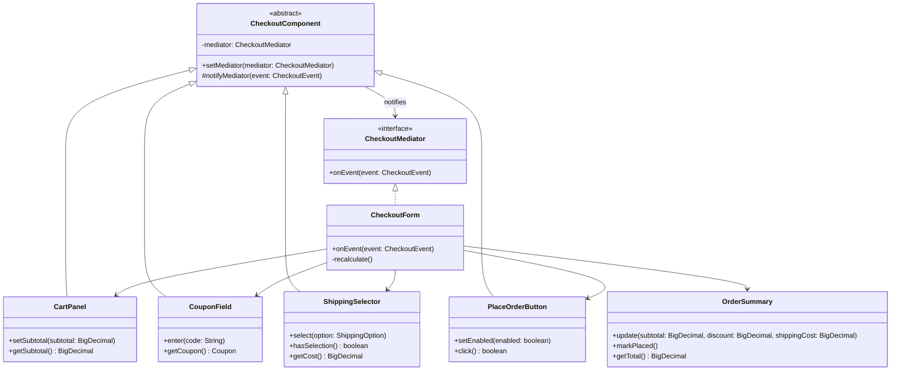

# Mediator

**Category:** Behavioral · **Source:** [`src/main/java/com/javapatternslab/mediator/`](../../src/main/java/com/javapatternslab/mediator) · **Test:** [`MediatorTest`](../../src/test/java/com/javapatternslab/mediator/MediatorTest.java)

## Problem

A checkout screen is made of parts that affect each other: the cart, a coupon field, a shipping selector, an order summary and a "place order" button. Entering a free-shipping coupon must zero the shipping cost; changing the cart must recompute the discount; the button may only be enabled when the cart has items **and** shipping is chosen. If each part reaches into the others to apply these rules, every component ends up knowing about every other one, the rules are spread across five classes, and none of the parts can be reused or tested on its own.

## Solution

The parts stop talking to each other. Each one extends `CheckoutComponent`, holds a reference to a `CheckoutMediator` only, and reports what happened to it as a `CheckoutEvent` (`CART_CHANGED`, `COUPON_ENTERED`, `SHIPPING_SELECTED`, `PLACE_ORDER_CLICKED`). `CheckoutForm`, the concrete mediator, is the only class that knows all the components. On an event it reads their current state, applies every cross-component rule in one `recalculate()` method, and pushes the result to `OrderSummary` and `PlaceOrderButton`.

Because the form recomputes from current state instead of reacting to the order in which events arrived, "coupon then shipping" and "shipping then coupon" give the same result. Adding a rule such as "pickup is unavailable above R$1,000" touches `CheckoutForm` and nothing else.

Compared with [Observer](observer.md): an observer subject broadcasts to listeners that do not coordinate with each other. A mediator is the place where the coordination itself lives. The cost is that the mediator can grow into a class that knows everything, so it should hold interaction rules only, never the components' own behaviour.

## UML



## Try it

```bash
mvn -q compile exec:java -Dexec.mainClass="com.javapatternslab.mediator.MediatorDemo"
```

`MediatorDemo` fills in a checkout step by step — cart, express shipping, a 10% coupon, then a free-shipping coupon — printing the summary and the button state after each step, and finally places the order.
