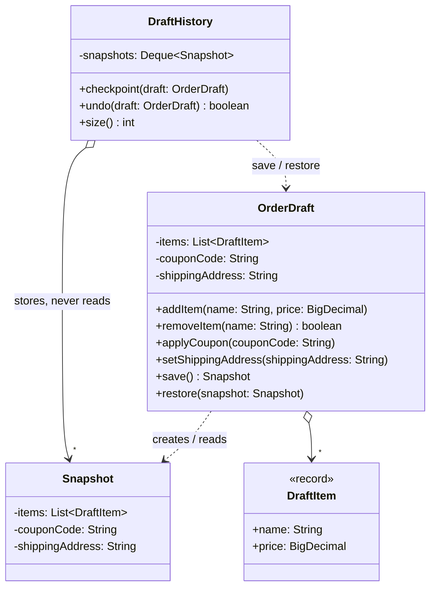

# Memento

**Category:** Behavioral · **Source:** [`src/main/java/com/javapatternslab/memento/`](../../src/main/java/com/javapatternslab/memento) · **Test:** [`MementoTest`](../../src/test/java/com/javapatternslab/memento/MementoTest.java)

## Problem

While a customer edits an order draft — adding and removing items, applying a coupon, changing the address — the screen needs an "undo" that returns the draft to an earlier point. Something outside the draft has to keep those earlier states. But if that code copies the draft's fields itself, the draft must expose all of its internals through getters and setters, and every new field added to the draft silently breaks undo until the copying code is updated too.

## Solution

Three roles. `OrderDraft` is the **originator**: `save()` packs its current state into a `Snapshot`, and `restore(snapshot)` unpacks one. `OrderDraft.Snapshot` is the **memento**: a nested class whose constructor and fields are `private`, so in Java only the enclosing `OrderDraft` can build or read it. `DraftHistory` is the **caretaker**: it keeps a stack of snapshots and decides when to restore, but to it a snapshot is an opaque token. Encapsulation is preserved — the knowledge of what makes up a draft's state stays inside `OrderDraft`, and adding a field means changing `save()`, `restore()` and `Snapshot`, all in one file.

The snapshot stores its **own copy** of the item list (`List.copyOf`). Storing the live list would make every snapshot change along with the draft, and undo would restore nothing.

Compared with [Command](command.md), which also offers undo in this catalog: a command undoes by running the *inverse operation*, so each action needs to know how to reverse itself. A memento restores a *whole earlier state* without knowing what changed in between — simpler when changes are many and varied, more expensive when the state is large.

## UML



## Try it

```bash
mvn -q compile exec:java -Dexec.mainClass="com.javapatternslab.memento.MementoDemo"
```

`MementoDemo` edits a draft in three steps with a checkpoint before each change, then undoes twice, printing the draft after every step, and shows that a third undo has nothing left to restore.
