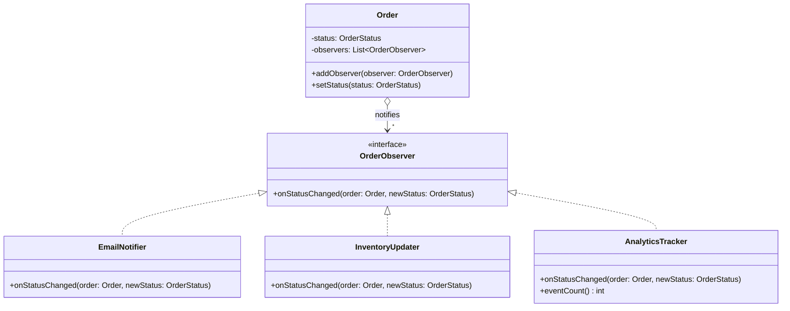

# Observer

**Category:** Behavioral · **Source:** [`src/main/java/com/javapatternslab/observer/`](../../src/main/java/com/javapatternslab/observer) · **Test:** [`ObserverTest`](../../src/test/java/com/javapatternslab/observer/ObserverTest.java)

## Problem

When an `Order`'s status changes (e.g. `PAID`, `SHIPPED`, `DELIVERED`), several unrelated things need to happen: send the customer an email, update inventory, record an analytics event. Hard-coding all three calls inside `Order.setStatus(...)` couples the order entity to email, inventory and analytics code, and every new "thing that reacts to a status change" means editing `Order` again.

## Solution

`Order` (the subject) keeps a list of `OrderObserver`s and calls `update(order)` on each one whenever its status changes — it has no idea what the observers actually do. `EmailNotifier`, `InventoryUpdater` and `AnalyticsTracker` each implement `OrderObserver` and register themselves with the order. Adding a new reaction to status changes means writing a new observer and registering it — `Order` itself never changes.

## UML



## Try it

```bash
mvn -q compile exec:java -Dexec.mainClass="com.javapatternslab.observer.ObserverDemo"
```

`ObserverDemo` registers all three observers on one `Order` and walks it through `PAID` → `SHIPPED` → `DELIVERED`, printing what each observer does at every transition.
