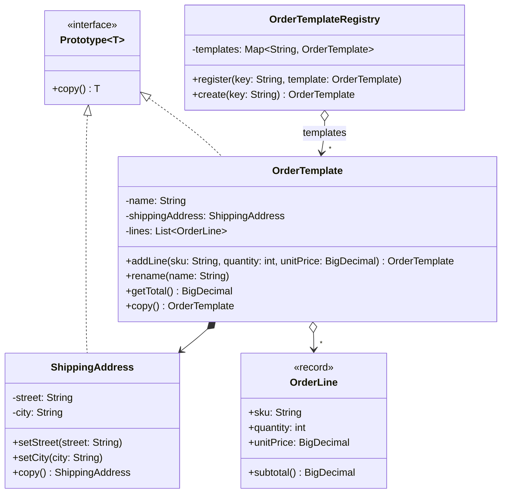

# Prototype

**Category:** Creational · **Source:** [`src/main/java/com/javapatternslab/prototype/`](../../src/main/java/com/javapatternslab/prototype) · **Test:** [`PrototypeTest`](../../src/test/java/com/javapatternslab/prototype/PrototypeTest.java)

## Problem

A store sells recurring orders — the same "monthly coffee kit" goes out to the same address every month, occasionally with one extra item or a changed address. Building each month's order from scratch repeats the same setup (name, address, every line) and forces the caller to know how an order is assembled. Handing out the stored template itself is worse: the first customer who adds an item or edits the address silently changes the template for everyone after them.

## Solution

`Prototype<T>` declares a single `copy()` method. `OrderTemplate` implements it by building a new `OrderTemplate` from its own fields, so the object that knows its internals is the one that duplicates them. The copy is **deep where it has to be**: the mutable `ShippingAddress` is itself a `Prototype` and is copied, while `OrderLine` is an immutable record and is safely shared. `OrderTemplateRegistry` keeps named templates and returns a fresh copy from `create(key)`; it also copies on `register`, so later changes to the object that was registered cannot reach the stored template.

`copy()` is used instead of `Object.clone()` on purpose: `clone()` is shallow by default, bypasses constructors and needs a cast, which makes exactly the shared-address bug above easy to write.

## UML



## Try it

```bash
mvn -q compile exec:java -Dexec.mainClass="com.javapatternslab.prototype.PrototypeDemo"
```

`PrototypeDemo` registers one coffee-kit template, creates a January and a February order from it, customizes February (extra line, new street), and prints all three to show the template is unchanged.
