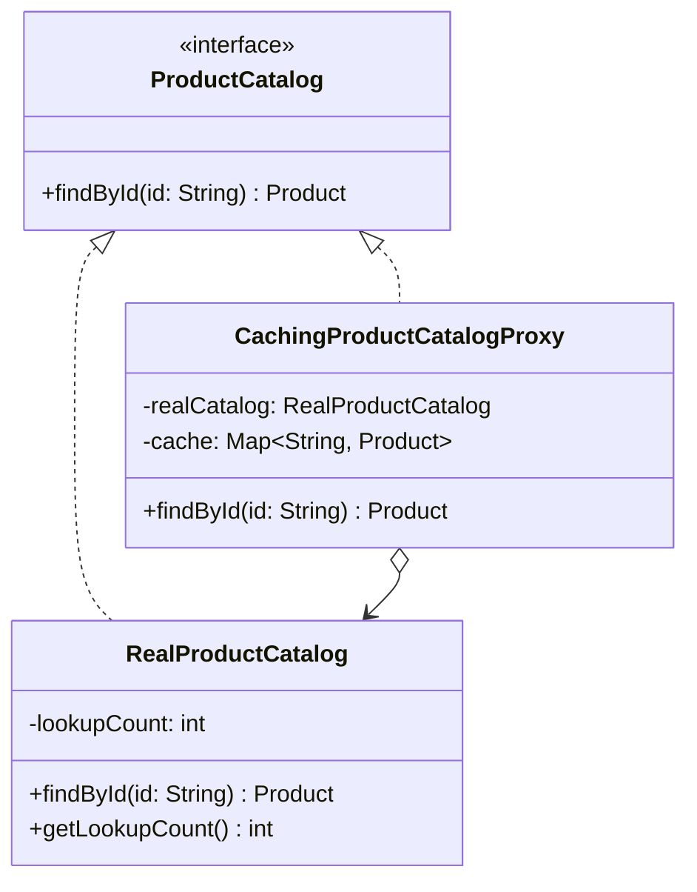

# Proxy

**Category:** Structural · **Source:** [`src/main/java/com/javapatternslab/proxy/`](../../src/main/java/com/javapatternslab/proxy) · **Test:** [`ProxyTest`](../../src/test/java/com/javapatternslab/proxy/ProxyTest.java)

## Problem

`RealProductCatalog.findById(id)` simulates an expensive lookup (a real one might hit a database or a remote service). Product listings that repeatedly ask for the same handful of popular products — the homepage, a "recently viewed" widget, a cart summary — end up re-paying that cost every time, even though the answer hasn't changed.

## Solution

`CachingProductCatalogProxy` implements the same `ProductCatalog` interface as `RealProductCatalog` and wraps an instance of it. On `findById(id)`, the proxy checks its own in-memory cache first; on a hit it returns the cached `Product` without touching the real catalog at all, and on a miss it delegates to the real catalog and caches the result before returning it. Callers depend only on `ProductCatalog` and can't tell whether they're talking to the real thing or the proxy — the caching is entirely transparent.

## UML



## Try it

```bash
mvn -q compile exec:java -Dexec.mainClass="com.javapatternslab.proxy.ProxyDemo"
```

`ProxyDemo` looks up the same product id three times through the proxy and prints the real catalog's lookup count afterward — it stays at 1.
