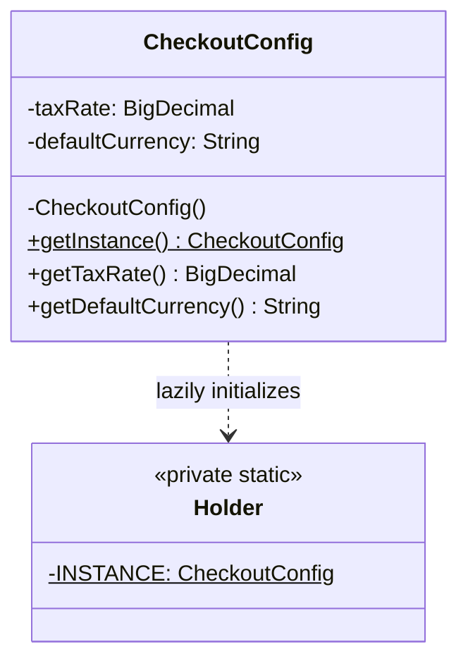

# Singleton

**Category:** Creational · **Source:** [`src/main/java/com/javapatternslab/singleton/`](../../src/main/java/com/javapatternslab/singleton) · **Test:** [`SingletonTest`](../../src/test/java/com/javapatternslab/singleton/SingletonTest.java)

## Problem

`CheckoutConfig` holds process-wide settings (tax rate, default currency) that every checkout in the app should read from the same place. Letting callers `new CheckoutConfig(...)` freely risks two parts of the app disagreeing on the tax rate at the same instant, and passing a config instance through every constructor that might need it is invasive.

## Solution

`CheckoutConfig` has a private constructor — nothing outside the class can call `new`. The single instance is created lazily, the first time `CheckoutConfig.getInstance()` is called, and every later call returns that same instance. The implementation uses the **initialization-on-demand holder idiom**: the instance lives as a `static final` field of a private nested class, which the JVM only loads (and thus only initializes) the first time it's referenced — thread-safe with no explicit `synchronized` block, because class initialization is already guaranteed atomic by the JVM's class-loading spec. (A single-element `enum` is Effective Java's usual recommendation for production Singletons — mentioned here for completeness, but the holder idiom is used in this repo because it's more instructive to read.)

## UML



## Try it

```bash
mvn -q compile exec:java -Dexec.mainClass="com.javapatternslab.singleton.SingletonDemo"
```

`SingletonDemo` calls `getInstance()` twice and prints whether both references point at the same object (`==`), plus its config values.
