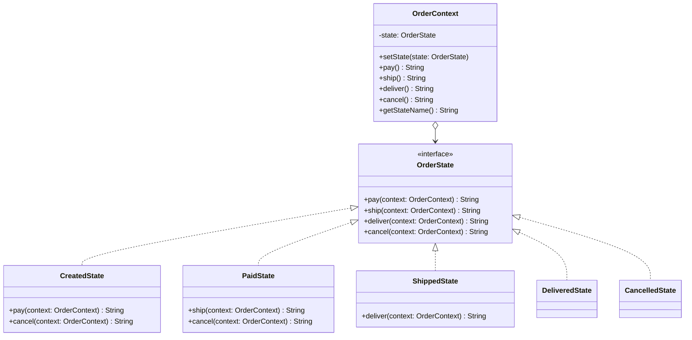

# State

**Category:** Behavioral · **Source:** [`src/main/java/com/javapatternslab/state/`](../../src/main/java/com/javapatternslab/state) · **Test:** [`StateTest`](../../src/test/java/com/javapatternslab/state/StateTest.java)

## Problem

An order can be paid, shipped, delivered or cancelled, and which actions are even valid depends entirely on its current status — you can `ship()` a paid order but not a `CREATED` one, and nothing is valid once an order is `DELIVERED`. Representing status as a plain enum field pushes all of this into `if (status == PAID) { ... } else if (status == SHIPPED) { ... }` conditionals scattered across every method that changes it, and every new status means editing all of them again.

## Solution

Status becomes an object, not a flag: `OrderState` is an interface with one method per action (`pay`, `ship`, `deliver`, `cancel`), each with a default implementation that just reports "invalid transition from this state." `CreatedState`, `PaidState` and `ShippedState` each override only the specific actions valid for that state, transitioning `OrderContext` to the next state object; `DeliveredState` and `CancelledState` are terminal and override nothing. `OrderContext` just delegates every action call to whatever `OrderState` it currently holds — it has no branching logic of its own, and adding a new state means writing one new class, not touching the others.

## UML



## Try it

```bash
mvn -q compile exec:java -Dexec.mainClass="com.javapatternslab.state.StateDemo"
```

`StateDemo` walks one order through `Created → Paid → Shipped → Delivered`, walks a second straight to `Cancelled`, and attempts an invalid `ship()` on a freshly created order to show the guard message.
