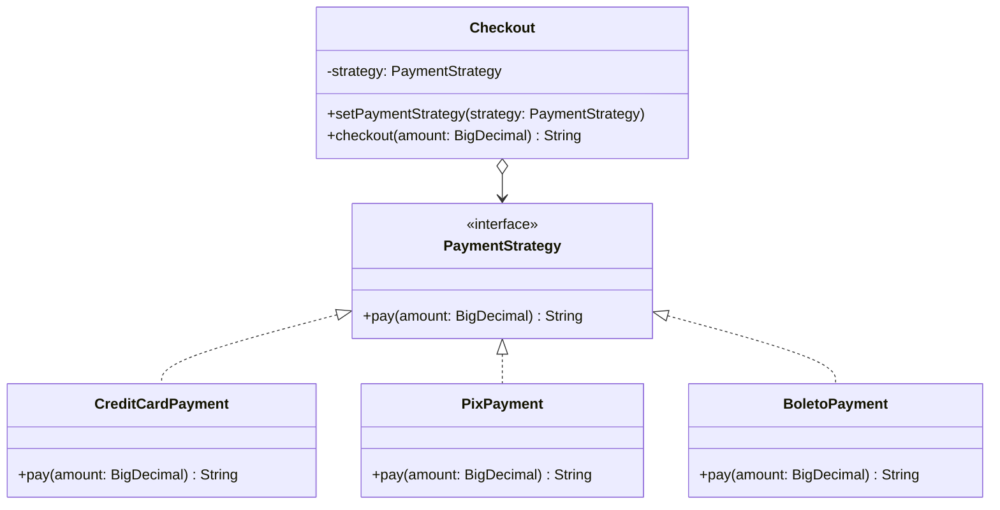

# Strategy

**Category:** Behavioral · **Source:** [`src/main/java/com/javapatternslab/strategy/`](../../src/main/java/com/javapatternslab/strategy) · **Test:** [`StrategyTest`](../../src/test/java/com/javapatternslab/strategy/StrategyTest.java)

## Problem

A `Checkout` needs to accept payment by credit card, Pix or boleto. The obvious first draft is a single method with an `if/else` (or `switch`) on a payment-type flag, computing fees and calling the right gateway inline. Every new payment method means editing that method again, and testing one payment type means dragging in the branching logic for all the others.

## Solution

Extract the varying behavior — "how do we pay this amount" — into an interface, `PaymentStrategy`, with one method: `pay(BigDecimal amount)`. Each payment method becomes its own class implementing that interface (`CreditCardPayment`, `PixPayment`, `BoletoPayment`). `Checkout` holds a `PaymentStrategy` reference and delegates to it, with no knowledge of which concrete strategy it's holding. The strategy can be swapped at construction time or at runtime (`checkout.setPaymentStrategy(...)`), and adding a new payment method never touches `Checkout` or the other strategies.

## UML



## Try it

```bash
mvn -q compile exec:java -Dexec.mainClass="com.javapatternslab.strategy.StrategyDemo"
```

`StrategyDemo` runs the same `Checkout` against all three strategies and prints each result, showing the total behavior change from swapping one field.
