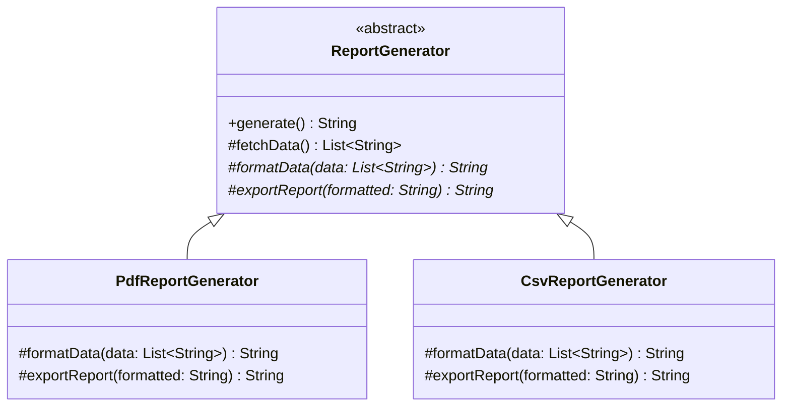

# Template Method

**Category:** Behavioral · **Source:** [`src/main/java/com/javapatternslab/templatemethod/`](../../src/main/java/com/javapatternslab/templatemethod) · **Test:** [`TemplateMethodTest`](../../src/test/java/com/javapatternslab/templatemethod/TemplateMethodTest.java)

## Problem

Generating a PDF report and generating a CSV report both follow the same three steps in the same order — fetch the underlying data, format it, export it to the target format — but each step's implementation is completely different per format. Writing two entirely separate `generate()` methods duplicates the fetch step (identical in both) and makes it easy for the two implementations to silently drift out of the shared step order.

## Solution

`ReportGenerator` is an abstract class with one concrete `generate()` method — the template method — that calls `fetchData()`, `formatData(data)` and `exportReport(formatted)` in a fixed order. `fetchData()` has a shared default implementation (both formats pull the same underlying data); `formatData` and `exportReport` are abstract, implemented differently by `PdfReportGenerator` and `CsvReportGenerator`. The algorithm's shape lives in exactly one place; subclasses only supply the steps that actually differ.

## UML



## Try it

```bash
mvn -q compile exec:java -Dexec.mainClass="com.javapatternslab.templatemethod.TemplateMethodDemo"
```

`TemplateMethodDemo` calls `generate()` on both a `PdfReportGenerator` and a `CsvReportGenerator`, showing the identical fetch step and the diverging format/export steps.
