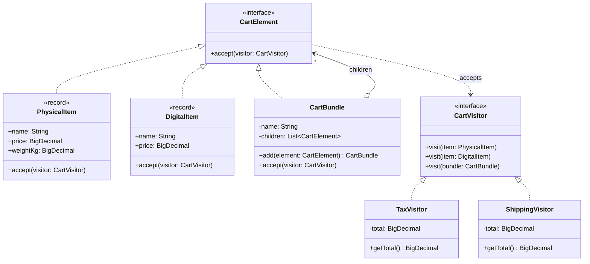

# Visitor

**Category:** Behavioral · **Source:** [`src/main/java/com/javapatternslab/visitor/`](../../src/main/java/com/javapatternslab/visitor) · **Test:** [`VisitorTest`](../../src/test/java/com/javapatternslab/visitor/VisitorTest.java)

## Problem

A cart is a tree of physical items, digital items and bundles (see [Composite](composite.md)). The business keeps asking for new calculations over that tree — tax, shipping cost, later customs value or loyalty points — and each one treats every element type differently: physical goods are taxed at one rate and shipped by weight, digital goods are taxed at another rate and never shipped. Adding a `calculateTax()` and a `calculateShipping()` method to every element class means reopening all of them for each new calculation, and scatters one business rule (say, "how shipping is priced") across several files.

## Solution

Each calculation becomes its own class. `CartVisitor` declares one `visit` overload per element type. Every `CartElement` implements `accept(visitor)` by calling `visitor.visit(this)` — inside `PhysicalItem`, `this` is statically a `PhysicalItem`, so the compiler picks the right overload. That pair of calls is **double dispatch**: the operation that runs depends on both the element's type and the visitor's type. `CartBundle.accept` also forwards the visitor to its children, so the structure owns the traversal and visitors only hold the rule.

`TaxVisitor` and `ShippingVisitor` each keep one whole rule in one file and accumulate a total as they are passed around the tree. A new calculation is a new visitor; no element class changes.

The trade-off runs the other way for new element types: adding a `GiftCard` element means adding a `visit(GiftCard)` to the interface and to every visitor. Visitor fits when the set of element types is stable and the set of operations keeps growing. In modern Java, a `sealed` element interface with a pattern-matching `switch` gives the same exhaustiveness check with less ceremony; the classic form is shown here because it is the one the pattern is named for.

## UML



## Try it

```bash
mvn -q compile exec:java -Dexec.mainClass="com.javapatternslab.visitor.VisitorDemo"
```

`VisitorDemo` builds a cart with a nested peripherals bundle and an e-book, then passes a `TaxVisitor` and a `ShippingVisitor` over the same tree and prints both totals.
